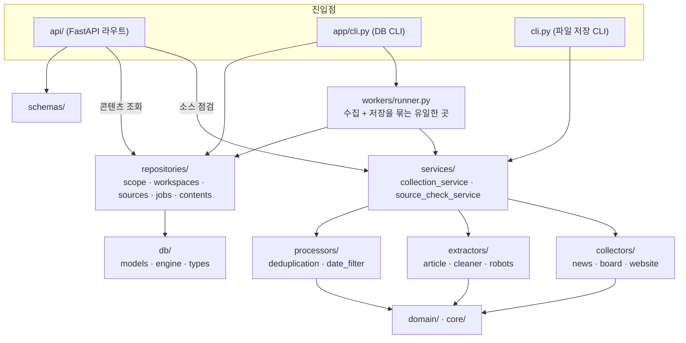
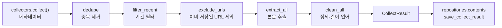
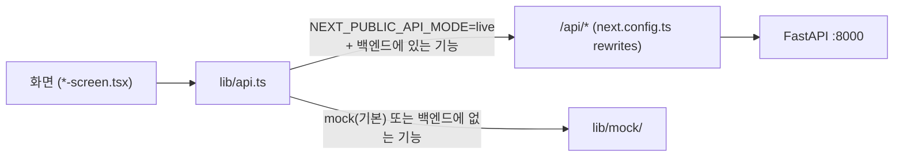

# 코드 구조

콘텐츠 수집 Agent 저장소의 코드 구조와 계층별 역할. DB 구조는 [db-schema.md](db-schema.md) 를 본다.
폴더를 더하거나 계층 규칙을 바꾸면 이 문서와 `CLAUDE.md` 를 함께 고친다.

## 1. 저장소 전체

```
content-collector-agent/
├── backend/            Python — 수집·DB·API (FastAPI)
├── frontend/           Next.js 16 App Router — 관리 화면
├── docs/               문서 · design/ (화면 시안, 기획서)
├── .env.example        환경변수 키 목록 (.env 는 루트, backend/.env 가 있으면 우선)
├── CLAUDE.md           작업 규칙
└── README.md
```

| 구분 | 기술 |
|---|---|
| 백엔드 | Python 3.11 · FastAPI · SQLModel(SQLAlchemy 2 + Pydantic 2) · Alembic · requests · trafilatura · BeautifulSoup/lxml |
| DB | SQLite(개발, `backend/data/app.db`) · PostgreSQL(운영) |
| 프론트엔드 | Next.js 16.3 (App Router) · React 19 · TypeScript · Tailwind CSS 4 |
| 테스트 | pytest (네트워크 없이 실행) |

## 2. 백엔드

### 2.1 폴더

```
backend/
├── app/
│   ├── core/           설정 · 시간대 · 로그
│   ├── domain/         파이프라인 값 객체(Article) · 선택지 Enum
│   ├── collectors/     수집기 — "어떤 글이 있는가" (메타데이터만)
│   ├── extractors/     본문 다운로드·추출 · 정제 · robots.txt
│   ├── processors/     중복 제거 · 기간 필터
│   ├── services/       수집 서비스 · 소스 점검 서비스 (저장하지 않음)
│   ├── db/             엔진 · 테이블 모델 · 컬럼 타입 · 시드
│   ├── repositories/   DB 조회·저장 (워크스페이스 범위 강제)
│   ├── workers/        수집 + 저장을 묶는 실행기
│   ├── schemas/        API 요청·응답 · 소스 설정 검증 (camelCase)
│   ├── api/            FastAPI 앱 · 의존성 · 라우터
│   └── cli.py          DB CLI
├── alembic/            마이그레이션 (versions/)
├── tests/              오프라인 테스트
├── cli.py              DB 없이 수집해 파일로 저장 (디버깅용)
├── data/               app.db · output/ · 로그 (git 제외)
├── alembic.ini · pytest.ini · requirements.txt
```

### 2.2 계층과 의존 방향



**규칙**

- 진입점(API·CLI·워커)은 `services/`·`repositories/`·`workers/` 함수만 부른다. 수집기·추출기를 직접 부르지 않는다.
- 수집과 저장을 묶는 곳은 `workers/runner.py` 하나다. 서비스는 저장하지 않는다.
- DB 조회·저장은 `repositories/` 로만 한다. 모든 함수가 `workspace_id` 를 필수로 받는다.
- repository 는 flush 까지만 한다. 커밋은 라우트·워커가 한다.
- 라우트는 서비스 결과(`Article`·dataclass)나 DB 모델을 `schemas/` 로 옮겨 담아 돌려준다.
- 세 가지 데이터 표현을 섞지 않는다.

  | 표현 | 위치 | 용도 |
  |---|---|---|
  | `Article` | `domain/content.py` | 수집 → 추출 → 정제 사이를 오가는 값 |
  | `Content` 등 | `db/models.py` | DB 테이블 |
  | `ContentDetail` 등 | `schemas/` | API 응답 (camelCase, 시각은 DISPLAY_TZ) |

### 2.3 모듈별 역할

**core/**

| 파일 | 역할 |
|---|---|
| `config.py` | 환경변수 설정 (네이버 키, `DATABASE_URL`, `DISPLAY_TZ`, `RESPECT_ROBOTS`, `BOARD_REQUEST_DELAY`, `BOARD_MAX_WORKERS` 등). 유저별 값(키워드·건수·기간)은 두지 않는다 |
| `timeutil.py` | UTC ↔ 표시 시간대 변환의 유일한 창구. `to_display_iso`, `display_today`, `recent_days`, `days_to_utc_range`, `display_date`, `schedule_at`, `next_daily_run` |
| `logger.py` | 콘솔·파일 로그 (타임스탬프는 DISPLAY_TZ) |

**domain/**

| 파일 | 역할 |
|---|---|
| `content.py` | `Article` — 파이프라인 값 객체. `body`(원본)와 `body_clean`(정제본)을 둘 다 가진다 |
| `enums.py` | `SourceType`, `JobStatus`, `CollectionPath` 등 선택지. DB 에는 문자열로 저장 |

**collectors/** — 제목·URL·날짜만 채우고 본문은 비워 둔다

| 파일 | 역할 |
|---|---|
| `base.py` | `Collector` 추상 클래스. 새 수집원은 상속해 `collect()` 만 구현 (필요하면 `fetch()`) |
| `news.py` | 네이버 검색 API(뉴스). `search`, `search_many`, `NewsCollector` |
| `board.py` | 게시판 목록 → 글 링크. 수동 설정(CSS 선택자) 또는 자동 탐지(URL 모양 묶음). `BoardConfig`, `detect_groups`, `list_posts`, `fetch_post`, `BoardCollector` |
| `website.py` | 유저가 넣은 글 URL 하나씩. `WebsiteCollector` |

**extractors/**

| 파일 | 역할 |
|---|---|
| `article.py` | HTML 다운로드(인코딩 판별) · trafilatura 본문 추출. `fetch_html`, `extract_body`, `extract_all` |
| `cleaner.py` | 본문 정제 단계(캡션·바이라인·저작권 문구·외국어 줄 제거 등). `clean_content`, `clean_all`, `diagnose` |
| `robots.py` | robots.txt 확인 (사이트별 캐시). `allowed` |

**processors/**

| 파일 | 역할 |
|---|---|
| `deduplication.py` | `canonical_url`(추적 파라미터·fragment 제거), `dedupe` |
| `date_filter.py` | `parse_dt`, `filter_recent`(days·since), `latest_published` |

**services/** — 저장하지 않는다

| 파일 | 역할 |
|---|---|
| `collection_service.py` | `collect_keywords` · `collect_board` · `collect_urls` → `CollectResult`(articles, stats, raw, failed_keywords, latest_published) |
| `source_check_service.py` | 저장 전 점검. `search_preview` · `detect_board` · `check_urls`. 실제 수집과 같은 규칙을 쓴다 |

**db/**

| 파일 | 역할 |
|---|---|
| `engine.py` | `DATABASE_URL` 로 엔진 생성. SQLite 는 `PRAGMA foreign_keys=ON`. `get_session` |
| `models.py` | SQLModel 테이블 7개 (`WorkspaceScoped` 상속) |
| `types.py` | `UTCDateTime`(naive 거부), `str_enum` |
| `seed.py` | 기본 워크스페이스 생성 (`python -m app.db.seed`) |

**repositories/**

| 파일 | 역할 |
|---|---|
| `scope.py` | `scoped_select`, `get_scoped` — workspace_id 필터를 강제. 다른 워크스페이스 id 는 None |
| `workspaces.py` | `get_workspace`, `ensure_default_workspace` (`DEFAULT_WORKSPACE_ID`) |
| `sources.py` | 소스 CRUD, config 검증, 키워드 추가·삭제(`normalize_keyword`) |
| `jobs.py` | `create_job` → `mark_running` → `finish_job` / `fail_job` |
| `contents.py` | `save_collect_result`(원본 응답·콘텐츠·키워드 기록 저장), `seen_urls`, 목록·검색·상세, 일별 집계 |

**workers/**

| 파일 | 역할 |
|---|---|
| `runner.py` | `run_source_once` — job 생성 → running(커밋) → `collect_*` → `save_collect_result`(커밋). 예외는 롤백 후 `fail_job` |
| `reclean.py` | `reclean_contents` — 저장된 원본(raw_body)을 지금 정제 규칙으로 다시 정제해 `cleaned_body`·`body_length` 갱신. 최소 길이 미만이 된 글은 지우지 않고 알려 준다 |

**schemas/**

| 파일 | 역할 |
|---|---|
| `base.py` | `CamelModel`(snake ↔ camelCase), `DisplayDateTime`, `display_iso` |
| `source_check.py` | 소스 점검 요청·응답 |
| `contents.py` | 콘텐츠 목록·상세 요청·응답 |
| `sources.py` | 소스 선택지 응답 |
| `source_config.py` | 소스 유형별 `config` 검증 (`NewsKeywordConfig`, `BoardSourceConfig`, `UrlSourceConfig`) |

**api/**

| 파일 | 역할 |
|---|---|
| `main.py` | FastAPI 앱, 라우터 등록(모두 `/api` 아래), `/health` |
| `deps.py` | `get_current_workspace`(지금은 기본 워크스페이스, 인증을 붙이면 여기만 바꾼다), `get_session`, `not_found` |
| `routes/source_checks.py` | `POST /api/source-checks/search · board · urls` (저장 없음) |
| `routes/contents.py` | `GET /api/contents`, `GET /api/contents/{id}` (기간: `from`·`to` 또는 `days`) |
| `routes/sources.py` | `GET /api/sources/options` (필터 선택지) |

### 2.4 수집 흐름



`A`~`G` 는 `services/collection_service.py`, `H` 는 `workers/runner.py` 가 부른다.
게시판·URL 수집은 `RESPECT_ROBOTS`, `BOARD_REQUEST_DELAY`, `BOARD_MAX_WORKERS` 를 지킨다.

### 2.5 진입점

| 진입점 | 명령 (`backend/` 에서) | 부르는 것 |
|---|---|---|
| API 서버 | `uvicorn app.api.main:app --reload --port 8000` | services(점검) · repositories(조회) |
| DB CLI | `python -m app.cli add-news-source · run-source · list-contents · reclean-contents · delete-content` | repositories · workers |
| 파일 CLI | `python cli.py keyword · url · detect · board` | services → `data/output/` 에 JSON·CSV |
| 시드 | `python -m app.db.seed` | repositories.workspaces |

### 2.6 테스트 (`backend/tests/`)

| 파일 | 대상 |
|---|---|
| `conftest.py` | DB 공통 fixture — 테스트마다 임시 SQLite 파일 |
| `test_offline.py` | 수집기·추출·정제·중복 제거 (HTML 고정 데이터) |
| `test_api.py` | 소스 점검 API |
| `test_contents_api.py` | 콘텐츠 조회 API |
| `test_db.py` | 모델·repository·워크스페이스 격리 |
| `test_reclean.py` | 다시 정제 (dry-run, 원본 보존, 워크스페이스 격리) · 콘텐츠 삭제 |
| `test_runner.py` | `run_source_once` 성공·실패 (수집 함수는 가짜) |
| `test_migrations.py` | 임시 SQLite 에 upgrade·downgrade 실행, 모델과 일치 확인 |
| `test_timezone.py` | 시간대 규칙 (코드에 고정 오프셋이 없는지 포함) |

## 3. 프론트엔드

### 3.1 폴더

```
frontend/
├── app/
│   ├── layout.tsx          폰트 · Toast · 확인 모달
│   ├── globals.css         디자인 토큰 (@theme)
│   ├── not-found.tsx
│   ├── login/              MEMBER-001 로그인
│   └── (app)/              로그인 후 화면 — layout.tsx 가 사이드바(AppShell)·로그인 확인
│       ├── page.tsx        MAIN-001 대시보드
│       ├── contents/       CONTENT-001 목록 · [id] 상세
│       ├── sources/        SOURCE-001 목록 · new · [id]/edit · _form/ (유형별 폼 섹션)
│       ├── jobs/           JOB-001 수집 작업
│       ├── analysis/       ANALYSIS-001 키워드 분석
│       ├── settings/       SETTING-001 분석 설정
│       ├── dictionary/     SETTING-002·003 불용어 · 사용자 사전
│       └── admin/          ADMIN-001 관리자
├── components/
│   ├── layout/             AppShell · 세션 컨텍스트
│   └── ui/                 Button · Badge · Card · Table · Field · Pagination · Switch · Tabs · Toast · Confirm · 상태 화면
├── lib/
│   ├── api.ts              API 호출의 유일한 진입점
│   ├── types.ts            응답 타입 (백엔드 schemas/ 와 이름·형태를 맞춘다)
│   ├── labels.ts           상태값 → 문구·배지 색
│   ├── use-api-data.ts     로딩·오류·새로고침·폴링 훅
│   ├── cx.ts · download.ts
│   └── mock/               목업 데이터·구현 (api.ts 만 import)
└── next.config.ts          /api/* → BACKEND_URL 프록시
```

라우트 폴더는 `page.tsx`(라우트 진입)와 `*-screen.tsx`(클라이언트 화면 컴포넌트)로 나눈다.

### 3.2 API 연결



- 화면은 `lib/mock/` 을 직접 import 하지 않는다.
- 브라우저는 같은 주소의 `/api/*` 를 부르므로 CORS 설정이 없다.
- 백엔드에 기능이 생기면 `api.ts` 함수 본문만 `post()` 등으로 바꾸고 반환 타입은 유지한다.

**현재 live 로 연결된 기능** (그 밖은 모드와 관계없이 목업)

| `api.ts` | 백엔드 |
|---|---|
| 뉴스 검색 테스트 | `POST /api/source-checks/search` |
| 게시판 자동 탐지 | `POST /api/source-checks/board` |
| URL 확인 | `POST /api/source-checks/urls` |
| 콘텐츠 목록 `listContents` | `GET /api/contents` (기간은 `days`) |
| 콘텐츠 CSV `exportContents` | `GET /api/contents` 를 끝까지 받아 브라우저에서 CSV 생성 |
| 콘텐츠 상세 `getContent` | `GET /api/contents/{id}` |
| 소스 선택지 `listSourceOptions` | `GET /api/sources/options` |

- 백엔드 응답 형식은 `api.ts` 안에서만 다루고 화면 타입(`lib/types.ts`)으로 옮겨 담는다. 백엔드 시각은 이미 표시 시간대라 브라우저 시간대로 바꾸지 않는다.
- 키워드 관련도·형태소 지표는 백엔드에 아직 없다. live 응답은 `analyzed: false` 이고, 화면은 관련도 필터·열과 지표·상위 키워드 카드를 감추고 수집 정보(검색 키워드 순위)를 보여 준다.
- 소스 선택지를 live 로 바꿔서, 아직 목업인 화면(수집 작업·키워드 분석·사전)의 소스 필터도 live 모드에서는 실제 소스를 보여 준다.

## 4. 앞으로 붙일 것 (예정)

스케줄러(`next_run_at` 계산·Celery), 유저·인증(`api/deps.get_current_workspace` 교체), 키워드 분석, `docker-compose.yml`.
추가하기 전에 범위를 먼저 정한다 (`CLAUDE.md`).
