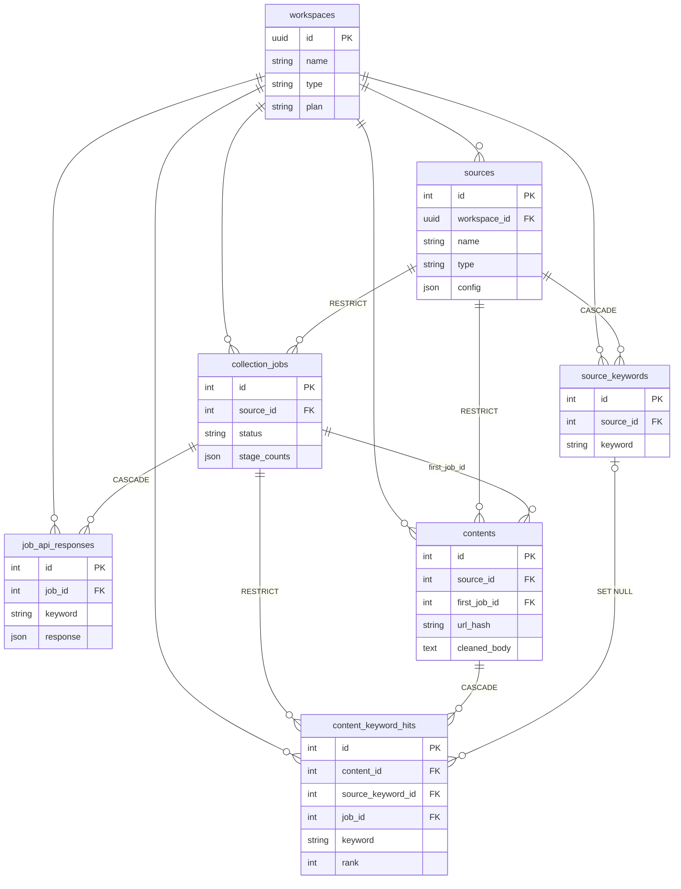

# DB 정의서

콘텐츠 수집 Agent 백엔드의 DB 구조. 기준은 `backend/app/db/models.py` 와 마이그레이션 `0001`(initial schema)이다.
모델을 바꾸면 이 문서도 함께 고친다.

## 1. 개요

| 항목 | 내용 |
|---|---|
| ORM | SQLModel (SQLAlchemy 2) |
| 마이그레이션 | Alembic — `backend/alembic/versions/` (현재 head: `0001`) |
| DBMS | 개발 SQLite (`backend/data/app.db`) · 운영 PostgreSQL. `DATABASE_URL` 하나로 바꾼다 |
| 테넌트 | 워크스페이스. `workspaces` 를 뺀 모든 테이블이 `workspace_id` 를 직접 가진다 |
| 시각 | 모두 UTC 로 저장 (`UTCDateTime`). 표시는 `DISPLAY_TZ`(기본 Asia/Seoul) |
| 선택지 | 네이티브 ENUM 대신 문자열 컬럼 `VARCHAR(20)` (`str_enum`), CHECK 제약 없음 |
| JSON | `sa.JSON` (PostgreSQL 에서도 JSONB 를 쓰지 않는다) |

## 2. ERD

`workspaces` 로 가는 외래 키는 모두 `ON DELETE RESTRICT` 다.

## 3. 테이블 목록

| 테이블 | 설명 | 만드는 곳 |
|---|---|---|
| `workspaces` | 테넌트 (개인 1인 / 회사) | `repositories/workspaces.py`, `app.db.seed` |
| `sources` | 수집 설정의 단위 (뉴스 키워드·게시판·URL) | `repositories/sources.py` |
| `source_keywords` | 뉴스 키워드 소스의 검색어 | `repositories/sources.py` |
| `collection_jobs` | 수집 1회 실행 기록 | `repositories/jobs.py` |
| `job_api_responses` | 외부 API(네이버) 원본 응답 | `repositories/contents.save_collect_result` |
| `contents` | 수집된 콘텐츠 (시스템만 만든다) | `repositories/contents.save_collect_result` |
| `content_keyword_hits` | 콘텐츠를 어떤 키워드로 몇 위에서 찾았는지 | `repositories/contents.save_collect_result` |

## 4. 테이블 정의

표기: **PK** 기본 키 · **FK** 외래 키 · **NN** NOT NULL · 시각 컬럼은 모두 `DateTime(timezone=True)`, UTC.

### 4.1 workspaces — 워크스페이스

| 컬럼 | 타입 | NN | 기본값 | 설명 |
|---|---|---|---|---|
| `id` | UUID | PK | uuid4 | 워크스페이스 ID |
| `name` | VARCHAR(100) | ✓ | | 이름 |
| `type` | VARCHAR(20) | ✓ | | `WorkspaceType` — personal / company |
| `plan` | VARCHAR(20) | ✓ | `free` | 요금제 |
| `created_at` | DATETIME | ✓ | 현재 시각 | 생성 시각 |

- 기본 워크스페이스: `00000000-0000-4000-8000-000000000001` / "기본 워크스페이스" / personal.
  `python -m app.db.seed` 가 만든다. 인증을 붙이기 전까지 API·CLI 는 이 워크스페이스를 쓴다 (`api/deps.get_current_workspace`).

### 4.2 sources — 수집 소스

| 컬럼 | 타입 | NN | 기본값 | 설명 |
|---|---|---|---|---|
| `id` | INTEGER | PK | 자동 증가 | 소스 ID |
| `workspace_id` | UUID | ✓ | | FK → `workspaces.id` (RESTRICT) |
| `name` | VARCHAR(100) | ✓ | | 소스 이름 |
| `type` | VARCHAR(20) | ✓ | | `SourceType` — news_keyword / board / url |
| `is_active` | BOOLEAN | ✓ | true | 사용 여부 |
| `schedule_type` | VARCHAR(20) | ✓ | `manual` | `ScheduleType` |
| `schedule_time` | VARCHAR(5) | | | `"HH:MM"`, DISPLAY_TZ 기준 |
| `cron_expr` | VARCHAR(100) | | | 값이 있으면 `schedule_type` 보다 우선 |
| `next_run_at` | DATETIME | | | 다음 실행 예정 시각 (스케줄러 단계에서 계산) |
| `last_collected_at` | DATETIME | | | 마지막 수집 시각 |
| `last_status` | VARCHAR(20) | | | 마지막 작업 상태 (`JobStatus`) |
| `last_published_at` | DATETIME | | | 지금까지 수집한 글 중 가장 늦은 발행 시각. 다음 실행의 `since` 로 쓴다 |
| `min_body_length` | INTEGER | ✓ | | 정제 후 최소 본문 길이 |
| `allow_non_korean` | BOOLEAN | ✓ | false | 한국어가 아닌 글 허용 |
| `config` | JSON | ✓ | `{}` | 소스 유형별 설정 (5장 참고) |
| `created_at` | DATETIME | ✓ | 현재 시각 | |
| `updated_at` | DATETIME | ✓ | 현재 시각 | |

인덱스: `ix_sources_workspace_id`, `ix_sources_next_run_at`

`last_published_at` 은 요청 수를 줄이려는 값이 아니다. 수집이 조회 기간보다 오래 멈췄을 때, 그 공백까지 조회 창을 넓히는 데 쓴다 (`processors/date_filter.filter_recent`).

### 4.3 source_keywords — 소스 키워드

| 컬럼 | 타입 | NN | 기본값 | 설명 |
|---|---|---|---|---|
| `id` | INTEGER | PK | 자동 증가 | |
| `workspace_id` | UUID | ✓ | | FK → `workspaces.id` (RESTRICT) |
| `source_id` | INTEGER | ✓ | | FK → `sources.id` (**CASCADE**) |
| `keyword` | VARCHAR(100) | ✓ | | 검색어. 저장 전에 공백을 정리한다 (`normalize_keyword`) |
| `origin` | VARCHAR(20) | ✓ | `manual` | `KeywordOrigin` — manual / related_word |
| `created_at` | DATETIME | ✓ | 현재 시각 | |

- UNIQUE `uq_source_keywords_source_id_keyword` (`source_id`, `keyword`)
- 인덱스: `ix_source_keywords_workspace_id`, `ix_source_keywords_source_id`

### 4.4 collection_jobs — 수집 작업

| 컬럼 | 타입 | NN | 기본값 | 설명 |
|---|---|---|---|---|
| `id` | INTEGER | PK | 자동 증가 | |
| `workspace_id` | UUID | ✓ | | FK → `workspaces.id` (RESTRICT) |
| `source_id` | INTEGER | ✓ | | FK → `sources.id` (RESTRICT) |
| `trigger` | VARCHAR(20) | ✓ | | `JobTrigger` — scheduled / manual |
| `status` | VARCHAR(20) | ✓ | `queued` | `JobStatus` — queued → running → success / failed |
| `queued_at` | DATETIME | ✓ | 현재 시각 | 생성 시각 |
| `started_at` | DATETIME | | | 시작 시각 |
| `finished_at` | DATETIME | | | 종료 시각 |
| `duration_sec` | FLOAT | | | 걸린 시간(초) |
| `collected_count` | INTEGER | ✓ | 0 | 이번 실행에서 **새로** 저장한 콘텐츠 수 |
| `stage_counts` | JSON | ✓ | `{}` | 단계별 건수 (`CollectResult.stats` 그대로, 키는 한국어, 유형마다 다르다) |
| `error_message` | TEXT | | | 실패 사유. 일부 키워드만 실패해도 여기에 남긴다 |

인덱스: `ix_collection_jobs_workspace_id`, `ix_collection_jobs_source_id`

### 4.5 job_api_responses — API 원본 응답

| 컬럼 | 타입 | NN | 기본값 | 설명 |
|---|---|---|---|---|
| `id` | INTEGER | PK | 자동 증가 | |
| `workspace_id` | UUID | ✓ | | FK → `workspaces.id` (RESTRICT) |
| `job_id` | INTEGER | ✓ | | FK → `collection_jobs.id` (**CASCADE**) |
| `keyword` | VARCHAR(100) | ✓ | | 검색 키워드 |
| `response` | JSON | ✓ | `[]` | 네이버 검색 API `items` 원본 |
| `created_at` | DATETIME | ✓ | 현재 시각 | |

- 인덱스: `ix_job_api_responses_workspace_id`, `ix_job_api_responses_job_id`, `ix_job_api_responses_created_at`
- 검색 결과는 시점마다 달라 나중에 재현할 수 없으므로 남긴다. 보존 기간은 정하지 않았고, `created_at` 기준으로 일괄 삭제할 수 있게 인덱스를 두었다.

### 4.6 contents — 수집 콘텐츠

| 컬럼 | 타입 | NN | 기본값 | 설명 |
|---|---|---|---|---|
| `id` | INTEGER | PK | 자동 증가 | |
| `workspace_id` | UUID | ✓ | | FK → `workspaces.id` (RESTRICT) |
| `source_id` | INTEGER | ✓ | | FK → `sources.id` (RESTRICT). 처음 수집한 소스 |
| `first_job_id` | INTEGER | ✓ | | FK → `collection_jobs.id` (RESTRICT). 처음 저장한 작업 |
| `collection_path` | VARCHAR(20) | ✓ | | `CollectionPath` — naver / board / website |
| `url` | TEXT | ✓ | | 원본 URL |
| `normalized_url` | TEXT | ✓ | | 정규화 URL (`deduplication.canonical_url`) |
| `url_hash` | VARCHAR(64) | ✓ | | `normalized_url` 의 sha256 (hex) |
| `title` | TEXT | ✓ | `''` | 제목 |
| `publisher` | VARCHAR(200) | ✓ | `''` | 언론사·사이트명 (`Article.press`) |
| `published_at` | DATETIME | | | 발행 시각. 모르면 NULL |
| `summary` | TEXT | ✓ | `''` | 요약 (검색 API 설명 등) |
| `board_url` | TEXT | ✓ | `''` | 게시판 목록 URL (게시판 수집일 때) |
| `raw_body` | TEXT | ✓ | `''` | 정제 전 본문 (`Article.body`) |
| `cleaned_body` | TEXT | ✓ | `''` | 정제된 본문 (`Article.body_clean`) |
| `body_length` | INTEGER | ✓ | 0 | `len(cleaned_body)` |
| `collected_at` | DATETIME | ✓ | 현재 시각 | 수집(저장) 시각 |

- UNIQUE `uq_contents_workspace_id_url_hash` (`workspace_id`, `url_hash`)
- 인덱스
  - `ix_contents_workspace_id`
  - `ix_contents_workspace_id_collected_at` (`workspace_id`, `collected_at`) — 최근 수집 순 목록·일별 집계
  - `ix_contents_workspace_id_published_at` (`workspace_id`, `published_at`) — 발행일 기준 조회
  - `ix_contents_workspace_id_source_id` (`workspace_id`, `source_id`) — 소스별 필터
- 원본 HTML 은 저장하지 않는다. 사용자가 수정하는 데이터가 아니다.

### 4.7 content_keyword_hits — 키워드 검색 기록

| 컬럼 | 타입 | NN | 기본값 | 설명 |
|---|---|---|---|---|
| `id` | INTEGER | PK | 자동 증가 | |
| `workspace_id` | UUID | ✓ | | FK → `workspaces.id` (RESTRICT) |
| `content_id` | INTEGER | ✓ | | FK → `contents.id` (**CASCADE**) |
| `source_keyword_id` | INTEGER | | | FK → `source_keywords.id` (**SET NULL**) |
| `keyword` | VARCHAR(100) | ✓ | | 찾은 키워드 (문자열로도 보존) |
| `rank` | INTEGER | ✓ | | 검색 결과 순위 (1부터) |
| `job_id` | INTEGER | ✓ | | FK → `collection_jobs.id` (RESTRICT). 찾은 작업 |
| `found_at` | DATETIME | ✓ | 현재 시각 | 찾은 시각 |

- UNIQUE `uq_content_keyword_hits_content_id_keyword` (`content_id`, `keyword`) — (콘텐츠, 키워드)마다 처음 찾은 기록만 남는다
- 인덱스: `ix_content_keyword_hits_workspace_id`, `ix_content_keyword_hits_content_id`, `ix_content_keyword_hits_job_id`
- 소스에서 키워드를 지워도 `source_keyword_id` 만 NULL 이 되고 기록과 `keyword` 문자열은 남는다.

## 5. sources.config (JSON) 구조

저장 전에 `app/schemas/source_config.py` 로 검증한다. DB 에는 snake_case 로 저장하고, API 에서는 camelCase 로 주고받는다. 모르는 키가 있으면 거부한다(`extra="forbid"`).

**news_keyword** (`NewsKeywordConfig`) — 키워드 자체는 `source_keywords` 테이블에 둔다.

| 키 | 타입 | 기본값 | 설명 |
|---|---|---|---|
| `count` | int | 30 | 키워드당 검색 건수 (1 ~ 네이버 상한) |
| `sort` | `"sim"` \| `"date"` | `sim` | 관련도순 / 최신순 |
| `days` | int \| null | 3 | 최근 N일 발행분. null 이면 제한 없음 |

**board** (`BoardSourceConfig`) — `collectors/board.BoardConfig` 와 필드가 같고, `days` 가 더 있다.

| 키 | 타입 | 기본값 | 설명 |
|---|---|---|---|
| `list_url` | str | (필수) | 게시판 목록 URL (http/https) |
| `item_selector` | str | `''` | 목록 항목 CSS 선택자 |
| `link_selector` | str | `a[href]` | 글 링크 선택자 |
| `title_selector` | str | `''` | 제목 선택자 |
| `date_selector` | str | `''` | 날짜 선택자 |
| `body_selector` | str | `''` | 본문 선택자 |
| `page_param` | str | `''` | 페이지 쿼리 파라미터 이름 |
| `start_page` | int | 1 | 시작 페이지 |
| `max_pages` | int | 1 | 최대 페이지 수 |
| `max_items` | int | 50 | 최대 글 수 |
| `include_pattern` | str | `''` | 포함할 URL 정규식 |
| `exclude_notice` | bool | false | 공지 제외 |
| `list_pattern` | str | `''` | 자동 탐지에서 채택한 후보 묶음 |
| `days` | int \| null | null | 최근 N일 |

**url** (`UrlSourceConfig`)

| 키 | 타입 | 설명 |
|---|---|---|
| `urls` | list[str] | 글 URL 목록 (1개 이상, http/https, 중복은 입력 순서대로 하나만 남긴다) |

`min_body_length` 기본값(소스를 만들 때): news_keyword 100(`MIN_CLEAN_LEN`) · board 30 · url 30.

## 6. 코드값 (`app/domain/enums.py`)

| Enum | 쓰는 컬럼 | 값 |
|---|---|---|
| `WorkspaceType` | workspaces.type | `personal` 개인 1인 · `company` 회사 |
| `SourceType` | sources.type | `news_keyword` · `board` · `url` |
| `ScheduleType` | sources.schedule_type | `manual` · `hourly` · `daily` · `weekly` · `cron` |
| `JobTrigger` | collection_jobs.trigger | `scheduled` · `manual` |
| `JobStatus` | collection_jobs.status, sources.last_status | `queued` · `running` · `success` · `failed` |
| `KeywordOrigin` | source_keywords.origin | `manual` 직접 입력 · `related_word` 연관어 추천 |
| `CollectionPath` | contents.collection_path | `naver` · `board` · `website` |

값을 더할 때는 마이그레이션이 필요 없다. 이름을 바꾸거나 지울 때는 기존 행을 옮기는 마이그레이션을 함께 만든다.

## 7. 데이터 흐름 (수집 1회)

`workers/runner.run_source_once`:

1. `collection_jobs` 에 행을 만들고(`queued`) `running` 으로 바꾼다.
2. `contents.seen_urls()` 로 이미 저장된 URL 을 구해 수집 서비스(`collect_*`)에 `exclude_urls` 로 넘긴다.
3. `save_collect_result()`:
   1. `job_api_responses` — 키워드별 API 원본을 저장한다.
   2. `contents` — 워크스페이스 안에서 `url_hash` 가 없는 글만 새로 넣는다.
   3. `content_keyword_hits` — 이번 수집 글과 API 원본의 URL 중, 워크스페이스에 저장된 콘텐츠와 맞는 것에 (콘텐츠, 키워드) 기록을 더한다. 이미 저장돼 있어서 제외된 글도 기록은 쌓인다.
   4. 작업을 `success` 로 마치고 `sources.last_collected_at · last_status · last_published_at` 을 갱신한다.
4. 예외가 나면 롤백한 뒤 `jobs.fail_job()` 으로 `failed` 와 `error_message` 를 남긴다. 저장할 콘텐츠는 없다.

repository 는 flush 까지만 하고, 커밋은 워커·라우트가 한다.

## 8. 설계 규칙

- **워크스페이스 격리**: 조회·수정은 `repositories/` 함수로만 한다. 모든 함수가 `workspace_id` 를 필수로 받고, select 는 `scope.scoped_select()` / `get_scoped()` 로 만든다. 다른 워크스페이스의 id 는 None(→ 404)이 된다.
- **중복 저장 방지**: 같은 URL 은 워크스페이스마다 한 번만 저장한다. 워크스페이스가 다르면 같은 URL 도 따로 저장한다.
- **동시 실행 주의**: 같은 워크스페이스의 두 작업이 같은 URL 을 동시에 저장하면 UNIQUE 위반이 난다. 워커를 붙일 때 소스·워크스페이스 단위로 직렬화하거나 재시도해야 한다.
- **시각**: naive datetime 은 저장을 거부한다. SQLite 는 시간대를 떼어 UTC 로 저장하고, 읽을 때 UTC 를 다시 붙인다. 날짜 경계(오늘·최근 N일)는 DISPLAY_TZ 기준으로 계산한 뒤 UTC 로 바꿔 WHERE 에 쓴다. DB 의 시간대 함수는 쓰지 않는다.
- **SQLite 외래 키**: 연결할 때 `PRAGMA foreign_keys=ON` 을 켠다 (`db/engine.py`). 이것이 없으면 ON DELETE 가 동작하지 않는다.
- **제약 이름 규칙**: `pk_<테이블>`, `fk_<테이블>_<컬럼>_<참조 테이블>`, `uq_<테이블>_<컬럼>`, `ix_<컬럼 라벨>` (SQLite batch 모드로 제약을 지우려면 이름이 필요하다).
- **스키마 변경**: 모델을 고친 뒤 `alembic revision --autogenerate -m "..."` 로 마이그레이션을 만들고 확인·수정한다. `tests/test_migrations.py` 가 모델과 마이그레이션이 어긋나면 실패한다.
